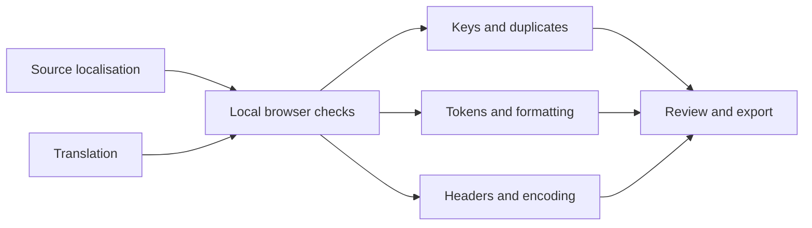

# ModLocale

**Offline localisation checks for Clausewitz mods.** Find missing or obsolete keys, duplicate entries, lost game tokens, malformed lines, and encoding or language-header issues before launching a mod.

ModLocale is a static browser app. Files are read on your device; the app does not upload them, call an API, or load third-party scripts or fonts.

## Try it

[Open the live demo](https://ghostnever-lkm.github.io/clausewitz-loc-guard/?demo) with a sample comparison already loaded.



To use your own files:

1. Open the live demo, or download the repository from **Code → Download ZIP**. For a local copy, start a static HTTP server in the extracted project folder (see [Run locally](#run-locally)) and open the local address. This avoids browser restrictions on loading JavaScript modules from `file://`.
2. Choose the source localisation file and the translation file.
3. Select the translation language and click **Check localisation**.
4. Review the findings. If needed, download a text report or a target-language file scaffold for missing source strings.

For an example, click **Load example** or add `?demo` to the URL.

## What it checks

- Keys missing from the translation and translation-only keys that may be outdated.
- Duplicate keys and lines outside the supported entry syntax.
- Differences in `$VARIABLE$`, Clausewitz formatting markers such as `§Y` and the `§!` reset, `£icon`, bracketed placeholders, common printf markers, and escaped control characters.
- UTF-8 BOM, language header, and conventional `_l_<language>.yml` or `.yaml` filename suffix.
- A downloadable plain-text report and a target-language scaffold for missing keys.

The interface is available in Russian and English, with common Paradox language codes and a custom-language option. File drop zones support keyboard access with Enter or Space.

## Supported format and limits

ModLocale focuses on the common Clausewitz localisation form:

```yaml
l_english:
 KEY_NAME:0 "Text with $VARIABLE$ and §Ygame formatting§!"
```

It handles UTF-8 input, an optional numeric version after the key, quoted values, and common backslash escapes. It is not a general YAML parser, translator, game launcher, or validator for every title-specific token. Review generated files in your mod and in the game before release.

## Run locally

No build step or dependency installation is required. Node.js 18 or newer is needed only for the regression tests.

```sh
python -m http.server 8000
```

Open `http://127.0.0.1:8000/`. Run the tests in a separate terminal with:

```sh
npm test
```

## License

MIT. See [LICENSE](LICENSE).

## ☕ Support / Pro Version

ModLocale is free and open source under MIT. Optional support helps maintain the project: [Buy Me a Coffee](https://buymeacoffee.com/azizazimov8) · [Boosty](https://boosty.to/azizazimov).

<details>
<summary>Public crypto addresses</summary>

Send only assets on the matching network.

| Network | Address |
|:--|:--|
| Bitcoin | `bc1qn75pj4n7gyl2k5kf2f97elvyenz52q6nn2g30u` |
| TRON | `TCBSy38X57hA6w2onJcxom24x1febc1mP1` |
| BNB Smart Chain | `0xD431a917961E0b086B96D9F72b5C8fF19b19068a` |

</details>
